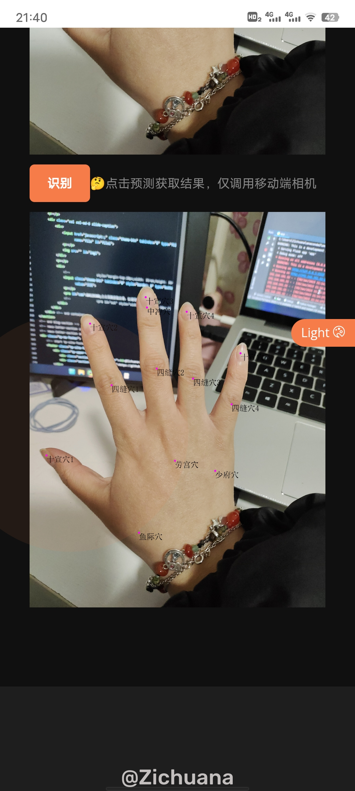
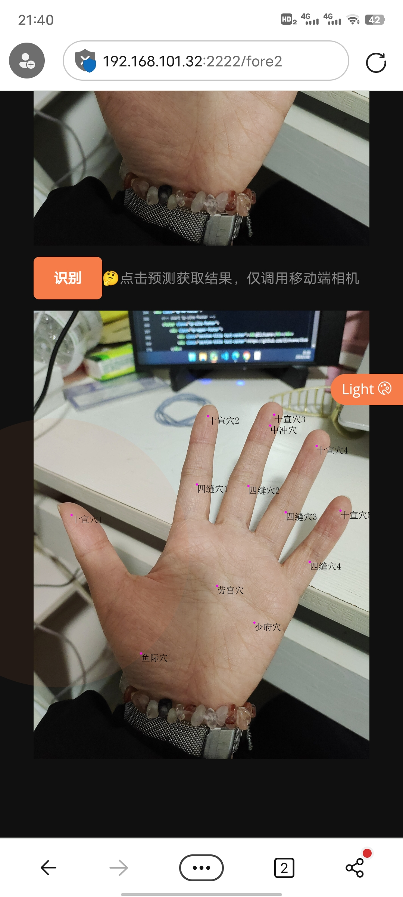

## 基于mediapipe的手部穴位识别
### 不严谨介绍
**剩余完成点：**  
1. 轴线外穴位优化  
2. 视频识别穴位  

**注意：**  
上传时处理data文件夹下文件  

**重要库版本：**  
```
mediapipe                      0.9.0.1
Flask                          2.2.1
torch                          1.12.1
torchvision                    0.13.1
```
不出意外不会有版本问题，未生成`requirements.txt`文件。
### 系统演示

